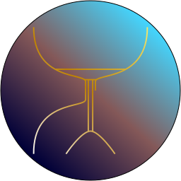

# Yata

Yet Another Timer App - A hackable timer

    

## About

Yata is a Timer App built on [Electron](https://github.com/electron/electron), using [Electron Forge](https://github.com/electron-userland/electron-forge). By default, it contains 4 pages: An alarm page, a reminder page, a task page, and a timer page. Furthermore, it can be extended to include other pages using [Web Components](https://developer.mozilla.org/en-US/docs/Web/Web_Components).

## Configuration

Currently, Yata contains one configuration (`useTray`) that is automatically generated in `src/userData/config.json`. When enabled, Yata will close to tray when the window is closed instead of exiting. It is enabled by default in Windows and MacOS.

## Customization

To customize `src/index.html`, modify `src/css/index.css`. To customize an individual component, modify the respective css `src/components/somecomponent/somecomponent.css`. To add a style that affects every (non-custom) component, as well as `src/index.html`, modify `src/css/global.css`.

## Extension

Although it is possible to directly add HTML/CSS and JavaScript, Yata was created with Web Components in mind. To that end, a custom WebComponent class was created (located in `src/utils/WebComponent.js`), which is the base for all components in Yata.
The overall procedure to create a new WebComponent is the following:

1. Create a directory `src/components/your-component-name`.
2. Add 2 files in the newly created directory named `your-component-name.js` and `your-component-name.html`. Optionally, add a third file named `your-component-name.css` for styling your component.
3. In `your-component-name.html`, add the desired HTML, nested in a `template` tag. You may also add CSS `link` tags.
4. In `your-component-name.js`, create a class that `extends WebComponent`. The base structure of the class should be the following:

        class YourComponentName extends WebComponent {
            constructor() {
            super('components/your-component-name/your-component-name.html'); // Declare which HTML file your component must use.
            // Your code here
            }

        async connectedCallback() {
            await super.connectedCallback(); // Load HTML file in the shadowRoot of the WebComponent.
            // Your code here
            }

            // Your methods here
        }
    More details regarding the shadowRoot can be found in [Using shadow DOM](https://developer.mozilla.org/en-US/docs/Web/Web_Components/Using_shadow_DOM).
5. After declaring your class, add `customElements.define('your-component-name', YourComponentName);`. More details regarding customElements.define can be found [here](https://developer.mozilla.org/en-US/docs/Web/API/CustomElementRegistry/define).
6. Add a `script` tag in index.html that links to `your-component-name.js` (make sure you add `defer` to your script!).
7. Finally, if your component is a page, you need to add a `button` tag in the `header`, and a `your-component-name` tag in the `page-view` div of index.html. Take note, that the order of the buttons corresponds with the order of the components, so the first button in the `header` corresponds with the first component in the `page-view`, etc.

## Building

Before building Yata, please make sure you have [Node](https://nodejs.org/) and [npm](https://www.npmjs.com/) installed. If both are installed, you can do the following to build from source:

1. Clone or download and extract this repository.
2. Open a terminal, and `cd` to the folder you have cloned or extracted this repository.
3. Run `npm install` to download required dependencies.
4. Run `npm run make` to build Yata. This will create an `out` directory with all the files required to install/run Yata.

## License

[MIT License](https://github.com/SASUPERNOVA/yata/blob/master/License.md)

